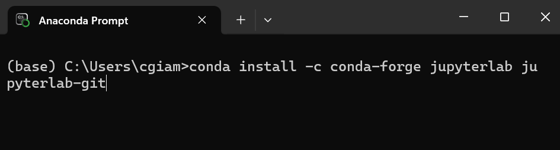
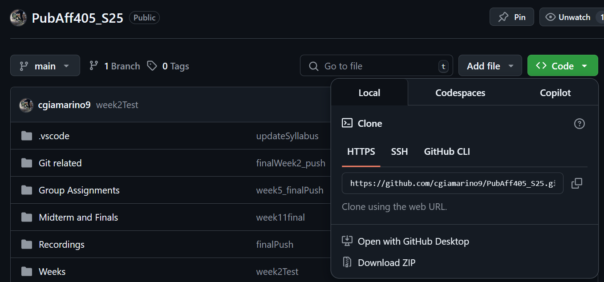
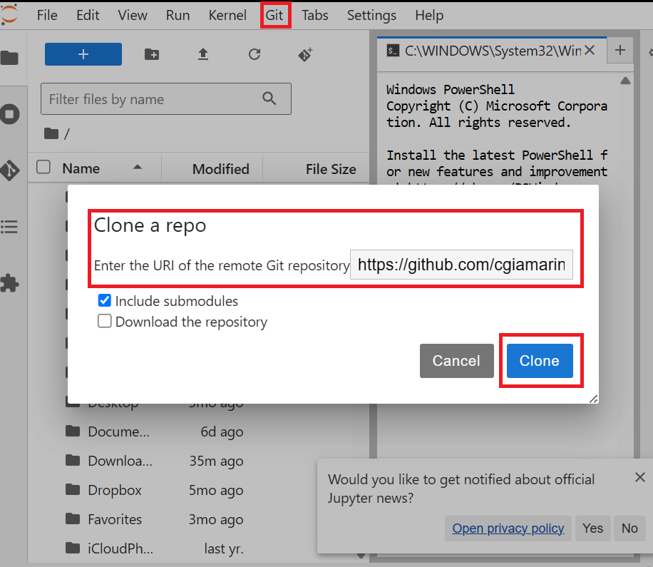

# Getting started each week
At the start of each week, you will be asked to update the class repository. Note that this is different from your own personaly repository. To do so, follow these instructions.

First, we will clone the course repository and then run a "pull" each week to download the latest course material into JupyterLab.

* Install the [GitHub extension for Jupyter Lab in the Anaconda terminal](https://github.com/jupyterlab/jupyterlab-git?tab=readme-ov-file#install)
<kbd></kbd>

* After installing the Git extension, type into the terminal `jupyter lab` to start a local notebook.

* Copy the course GitHub clone HTTPS link.

<kbd></kbd>

* Paste the course GitHub clone HTTPS link --> Git --> Clone a Repository --> Paste link --> Clone

<kbd></kbd> 

Note that the link above (git puller) follows the [following set of rules](https://jupyterhub.github.io/nbgitpuller/topic/automatic-merging.html#topic-automanbltic-merging).
