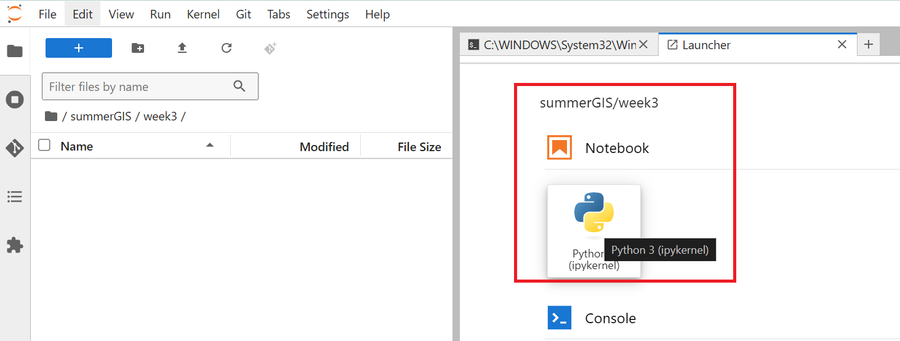
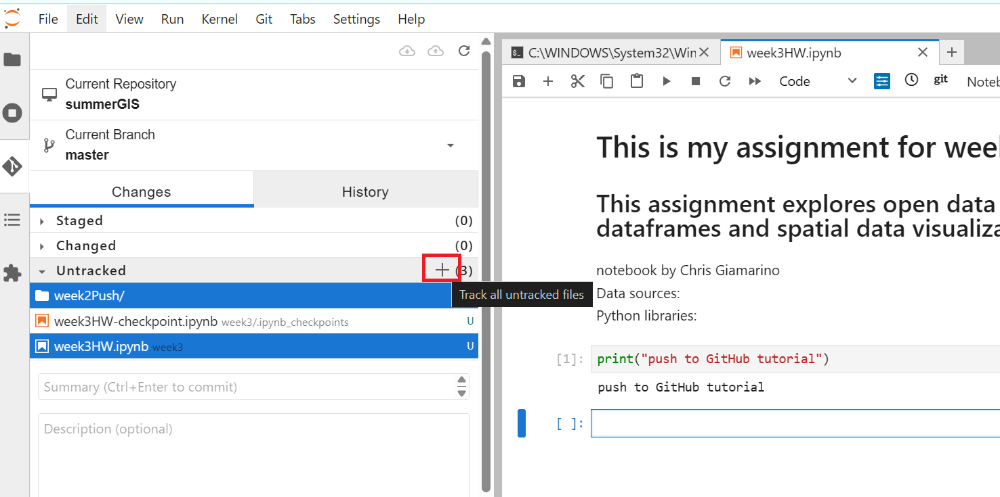
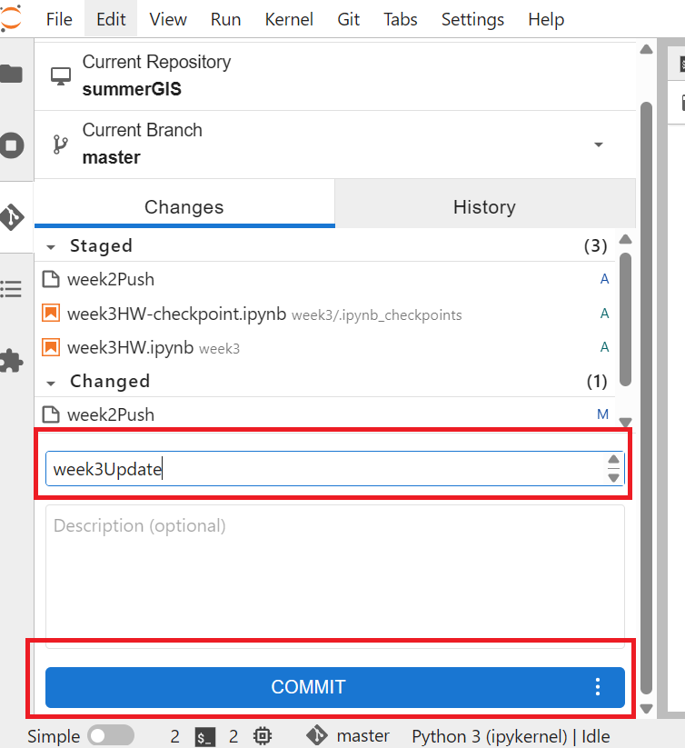
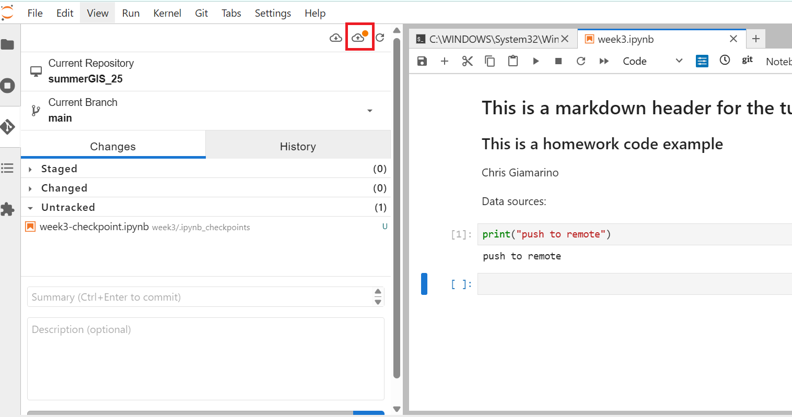
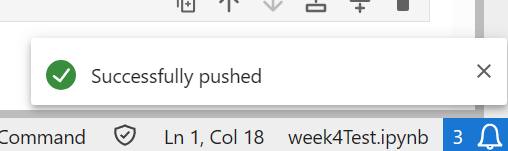

# Uploading and updating your repo

You have created your GitHub repository. You have cloned/downloaded it to your local machine. You have done work on the local copy. Now it is time to update your GitHub repository with your latest work. 

There are two ways for you to update your repo with your latest files.

## Method 1: Use the GUI

This is the easy method. Simply upload your file to the repo. First, navigate to your repo's home page on GitHub. Then, do the following:

<kbd></kbd>

<kbd></kbd>

<kbd></kbd>

### What if I want to update a file that is already on the repo?

If you made changes to an existing file in the repo and want to update it, all you have to do is upload it again. For example, if you have a file in your repo named `Week1-assignment.ipynb`, upload your updated file with the same file name into the repo. Git will recognized that you have updated the same file, and create a history of it.

<kbd></kbd>

<kbd></kbd>

## Method 2: Using the Git extension user interface

For intermediate users, clone your course GitHub HTTPS Repository link and use the JupyterLab Git extension to push and pull updates to your repo.

1. Git --> Clone a Repository --> Paste URL and save to your local computer where you want to store data.

1. Add folders, data, and notebooks. 

<kbd></kbd>

3. Switch between [Markdown](https://docs.github.com/en/get-started/writing-on-github/getting-started-with-writing-and-formatting-on-github/basic-writing-and-formatting-syntax) and Code to format your notebooks appropriately. 

1. Finalize your python notebook. Save your work. Make sure all code cells run successfully. 

1. Set up a [classic GitHub access token](https://youtu.be/iLrywUfs7yU?si=dSAULvG2vyvdtx5t) and save it locally. 

1. Navigate to the Git user interface on JupyterLab and select the folders and notebooks you want to `track` changes for. Hit the plus sign.

<kbd></kbd>

7. Add a Summary message and click Commit to commit your changes.

<kbd></kbd>

8. Push to your remote GitHub repo. 


<kbd></kbd>

9. If prompted, add your GitHub `username` (not your email) and your `personal access token`. 

<kbd></kbd>

## Method 3: Use the command line

For advanced users, the following steps outlines the commands you need to go through in order to update your repo.

1. Launch a terminal window/command prompt and navigate to your repo directory by using a combination of the following commmands:\
`pwd` find what your current directory is\
`ls` output the contents of your current directory\
`cd` change directory

1. Check the status. If there are files listed in red, this means that you have files you have created, modified, or deleted that you want to transfer to your repo.\
`git status`

1. pull data from your repo in case your copy is not up to date\
```git pull```

1. Add all the files you have created, modified, or deleted to your staging area\
`git add --all`

1. Check status again. Those red files should have turned green.\
```git status```

1. Commit it prior to pushing\
`git commit -m "include note as to what is being committed"`

1. Push it to your git repo. This is the final step that sends everything to your repo. You may be asked for your username and password.\
`git push`

